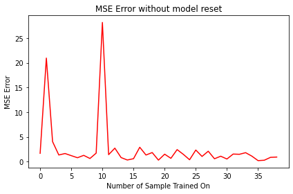

# PeNNdulum

## Comparing Reservoir Computing, Lagrangian, and Hamiltonian Neural Networks' Forecasts of Chaotic Systems in Physics

### Team Members

- Nathan Paik
- Guy Thampakkul
- Tai Xiang
- Ziang Xue

***

### Introduction

Lagrangian and Hamiltonian neural networks (LNN and HNN) output the Lagrangian and Hamiltonian equations for a system in motion. They were both developed for extremely physics-specific tasks, and this makes them relatively narrow in their scope. We seek to explore if they are capable of outperforming a more general-purpose neural network that is highly successful at predicting the behavior of chaotic systems, Reservoir Computing (RC). The task we will be using for comparison is the mechanics-based problem of forecasting the motion of a chaotic double pendulum. To verify this, we will train these networks on a dataset involving the IBM double pendulum dataset, which consists of the initial conditions and four frames of the pendulum's initial motion, and then 200 frames of its subsequent path of motion. If RC outperforms the two physics-specific networks, then the utility of these networks substantially decreases. However, in this case, we expect LNN and HNN to surpass RC, as the most common mathematical way to solve for the equations of motion for a double pendulum is by first solving the Lagrangian or Hamiltonian. 

To get an understanding of the performance of each of these neural networks against a more common baseline model, we will also be comparing all three of these models against a recurrent-neural network that will serve as the control. Though recurrent neural networks do not display the same chaos-forecasting abilities of reservoir computing, it is a good baseline for sequential systems.

Finally, to test the validity of each model on new and physical data. We will be taking multiple videos of a double pendulum provided by the Pomona College physics department, reading in its initial conditions and four frames of its initial motion, and then running each model on this system to determine its subsequent path. We will then validate this against its actual path and check for divergence. This will help us understand how each model works in a noisier system, as the IBM dataset was constructed with cutting-edge equipment and a fine-tuned system.

### Relative works

Similar work on chaotic systems and the double pendulum has been done before. Klinkachorn and Parmar at Stanford characterized the performance of neural networks on double pendulum's as the starting angle between the two pendulum arm's began to vary. However, they tested a range of machine learning algorithms and models, including linear regression, autoregression, feed-forward neural networks, and long-short term memory networks. Rudy et al. also demonstrated a novel method to train models that seek to fit dynamical systems on noisy data, and in this paper compare increasing levels of variance that arise when a neural network is used to predict an increasingly noisy double pendulum input.

Although sharing multiple similarities, our work primarily differs in that we seek to test models that hypothetically ought to perform quite well on this task. The RNN, a more primitive analog to the LSTM, is simply used as a baseline instead of as the most advanced model, and we extend upon prior work by testing LNN, HNN, and RC on the double pendulum task.

### Methods

#### Overview

The datasets used are the [IBM](https://ibm.github.io/double-pendulum-chaotic-dataset/) double pendulum dataset and a double pendulum simulation simulated dataset (which we wrote from scratch). The IBM dataset was generated from 21 different 40-second double pendulum sequences of 17500 annotated frames. Initially, we planned on building our own dataset with some computer vision code and a double pendulum setup provided by Pomona College Physics Department to test our trained networks on noisy systems (real world double pendulum), however we did not have time to complete this task. The simulated dataset, the IBM dataset, and computer vision dataset provides us with data on the same system with increasing levels of noise.

We trained and optimized a recurrent neural network, an echo state network (reservoir computing), and a Lagrangian Neural Network (did not get to Hamiltonian Neural Network). We used PyTorch to implement and train our recurrent neural network and [ReservoirPy](https://github.com/reservoirpy/reservoirpy) to implement and train our echo state network. ReservoirPy is a library on github based on Python scientific libraries used as a tool to help implement efficient Reservoir Computing Neural Networks, specifically Echo State Networks. In the process of exploring ESN libraries, we also looked at "easy-esn", "pytorch-esn", or "EchoTorch". Because Lagrangian Neural Networks are more physics and mathematics intensive and unique than mainstream neural networks, ours was constructed from scratch using existing examples online and on github. The work we relied relatively heavily on in the construction of our Lagrangian Neural Network is Miles Cranmer et al.’s [paper](https://arxiv.org/abs/2003.04630) and [github repo]((https://github.com/MilesCranmer/lagrangian_nns)) on LNNs with dependencies on more mainstream Python libraries including Jax, NumPy, MoviePy, and celluloid, with the latter two used for visualization purposes.

For analysis, we wrote graphing functions that emulates paths of the double pendulums under different initial conditions over time consistent with the laws of physics. We overlaid the theoretical paths with our network-generated paths to get a clear visual representation of how the different networks perform. Initially, we also planned to compare other statistical metrics, such as comparison through a confusion matrix, and F1 score comparison, but did not get to it in time.

- Data Wrangling and Preprocessing

Pre-processing involves unpacking and preparing the dataset for training uses. The datasets contain raw data of initial conditions and 2000 frames of the pendulum path. To make this usable for our training model, we first converted the raw coordinates to pixel (cartesian) coordinates, and then transformed those to polar coordinates. We decided to use polar coordinates as they encode information on both position and angle, which is especially effective for coupled oscillators. The data can now be fed into the network for training. We then separated our datasets into training data (for feeding into our networks) and training data for final network evaluations and network comparisons.

- Recurrent-Neural Network

The recurrent neural network was set up using PyTorch libraries. We fed training data into the network and performed hyperparameter optimization to attain a baseline model.

- Reservoir Computing

We trained the echo state network through ReservoirPy Python libraries. We also performed hyperparameter optimization on this model as well. The hyperparameter process differed from traditional neural networks (RNN), as we iterated through ESN specific parameters such as number of reservoirs, leaking rate, spectral radius, and regression parameters.

- Lagrangian Neural Network (and possible Hamiltonian Neural Network extension)

The Lagrangian (and Hamiltonian) Neural Network was written from scratch as their underlying mathematical equations and layers differ from conventional neural networks. Our code was written based on existing notebooks that have implemented these networks, most of which accompany their research papers from the same authors (see literature review of papers and links to code). For these networks, optimal hyperparameters are provided by the researchers and authors, so we did not have to optimize the parameters ourselves.

- Comparison and Results

To compare these networks, we looked at validation loss and accuracy, and comparing how well they perform on the testing set that was segmented from the IBM dataset. We will also be vetting each of these models on our noisey Pomona College double pendulum to see how well each model handles deviation from ideal circumstances.

### Discussion

#### Results and Network Comparisons

After building a LSTM model, a LNN model and trying to build an ESN model, we have find out the following:

The LSTM model is able to produce correctly shaped data that makes a vague sense. Eyeballing the output shows that it is somewhat related to the target, but after plotting the predicted coordinates, the prediction only shares the overall direction of the target, and is nowhere near being accurate. With the 4 input values all ranging between -1 and 1, we are getting a loss of about 0.2, which is quite high.

- The LNN model demonstrates an accurate prediction of the pendulum for the first few prediction frame, but once there is considerable error, the error propagates quickly throughout the system and make the prediction unreliable. However, this make sense since double pendulum is such a chaotic system and error propagates easily. Also, LNN prediction seems to follow the actual physical rules and conserve energy and momentum while making the prediction, which is a virtue most neural networks lack.

### ESN Model

Our ESN model takes as input the triangular functions of the angles formed by the arms and the vertical line. The key hyperparameters for our network are as follows:

```python
leak_rate = 0.1    #Decides the memory size of the reservoir. higher value means shorter memory.
spectral_radius = 25.0 #Higher values apply for more chaotic system
input_scaling = 0.5 #Smaller values (towards 0) leads to free behavior and higher values (towards 1) leads to input-driven behavior
regularization = 1e-7 #ridge optimization parameter.
forecase = 1 #use the next following frame as label.
```

The ESN trains on entire time series and use the same serie (but one frame later) as label. The network turns out to be extremely inaccurate in learning and predicting the movement of the end joint of the double pendulum.

First of all, the prediction accuracy does not depend on the size of the training data. We first trained the ESN on each sample sequence, tested the prediction error (MSE), and then reset the model to untrained state. We then trained another model on the entire dataset (40 sequence) without reset. Figure *1(a)* shows the MSE with resetting and figure *1(b)* shows the MSE without resetting. Figure *1(c)* compares the errors from the two model.

Figure 1a            |  Figure 1b|  Figure 1c
:-------------------------:|:-------------------------:|:-------------------------:
  |   |  

We see from the figures that the MSE loss are relatively similar for both models, which implies that size of training data does affect model precision.

This could be accounted to the limited "memory" for an ESN network. When training on large dataset, new incoming data takes away memory space of the network and make it "forgets" earlier inputs that it has learned.

We observe that this is not due to the specific sequence we tested the ESN upon. The sequences varies in their difficulty to train, but the the difference is within range of the error predicting one sequence can produce. This is shown in figure *2*


Changing the `leak_rate` parameter for a longer term of memory does not solve is problem.

`TODO`: do 3 model with different leak_rate and compare diff. of resetting/noresseting.

The discussion section will be presenting the plots made from the LSTM and LNN models, and provide the corresponding loss.

The interpretation goes in the paragraphs above.

This result proves our assumption that all 3 of RNN (LSTM), ESN and LNN are not very accurate at predicting double pendulum, but overall RNN < LNN (ESN not included since unfortunately it has not been working). This also proves our assumption that LNN makes a physically credible prediction and is able to learn the actual physical rules of the system.

The result section should also feature a discussion of how and why ESN failed to work.
#### Ethical Implication and Discussion

A possible ethical issue in this instance is the use of overideal training data. The IBM double pendulum dataset that is used for training is a dataset that is clean and not noisy: it is filmed with a high speed camera in a controlled environment, with carefully measured axis markers and angular values. However, it is possible that the models we train with this dataset are incapable of handling a noisy system, such as validation on a user-generated double pendulum path. We will analyze this issue in our validation of each model with the Pomona College double pendulum. 
 
This ethical implication has far reaching issues in multiple areas. If a trained model is only able to operate in the space of clean data, then in certain edge-cases or uncommon cases, the model will experience a high error rate. This is especially alarming in areas such as facial or speech recognition, where there may be high amounts of variation in the noisiness of images or audio, and error may result in a range of consequences from inconvenience to life-changing.

***

### Reflection

What would you do differently next time?

- Reach out to authors and researchers much earlier in the process and ask for help. It turned out that they were pretty responsive and excited that there are people working on extensions to their projects. If we did it earlier, we think our jobs would have been much easier. We also should have started training our networks earlier so we would have more time to make adjustments and tune our hyperparameters more.
- Do more readings earlier on.
- Spend more time training each network.
- Ask more questions.
- Do more research on how to compare different kinds of Neural Networks and how to make sure we're not putting in more time or effort into one or the other. Example: theoretically LNNs are supposed to perform the best. But did it perform the best in our research because of reseacher bias or because it actually did?

How would you continue this work (e.g., what extensions would you pursue)?

- Hamiltonian network.
- Work on all three kinds of datasets more completely.
- Use more statistical metrics for network comparison.

***

### Update 1

#### Software Used: 

For training our reservoir computing model, we will be using the [*easyESN*](https://github.com/kalekiu/easyesn) python library. To train our Lagrangian Neural Network, we will be writing some functions from scratch and imported pre-trained hyperparameters indicated by the Lagrangian Neural Network research paper. For the Hamiltonian Neural Networks, we can import the pre-trained models released by the team that published the paper on Hamiltonian Neural Networks, or train our own with PyTorch. We will train the recurrent neural network with PyTorch.

#### Dataset:

We will be using the [*IBM Double Pendulum Dataset*](https://ibm.github.io/double-pendulum-chaotic-dataset/). This is a dataset that consists of four frames of input for a double pendulum system, followed by 200 predicted frames. Furthermore, IBM lists of the camera parameters used for the construction of this dataset, thus we can create further training data. The physics department has a double pendulum filming setup as well as some matlab code that is capable of translating video inputs into cartesian coordinate outputs, and thus we can create more data if desired.

Quick note on getting the dataset: create a new folder `Data` in the repo, `cd` into it, and run:

```bash
wget https://dax-cdn.cdn.appdomain.cloud/dax-double-pendulum-chaotic/2.0.1/double-pendulum-chaotic.tar.gz
tar xzf double-pendulum-chaotic.tar.gz
```
I've already added a `.gitignore` file so it won't be pushed to the repo as long as the folder is called `Data` and it's right under `/physinet.io`.

##### Contents and Dimensions of Dataset:

We will mainly be using the coordinate info in the dataset and put aside the `.mkv` videos for now. The coordinates are stored in csv files and each frame has 6 entries: the `x` and `y` coordinate of the 3 axis of the double pendulum. We will be defining method that convert data for each frame into a `1x4` vector of: `sin_angle_green_red`, `cos_angle_green_red`, `sin_angle_blue_green`, 
`cos_angle_blue_green`. This vector is the sample.

There is an WIP Jupyter notebook that tries to make a baseline RNN out of these. I'm still going through the PyTorch docs to learn how to create RNNs.

#### General Overview:

We will be using recurrent neural networks, echo state networks (reservoir computing), Lagrangian neural networks, and Hamiltonian neural networks. In the case of the recurrent and echo state network, our data will be input as a vector describing the initial conditions. Our output for those two models will be a set of x and y coordinates corresponding to the path of the pendulum. These will just be a vector of floating-point values. We can then visualize these positions to get a general sense of the pendulum's travel over time.

For the Hamiltonian and Lagrangian neural networks, we will input a set of initial conditions. However, our corresponding outputs will be transformed to be a vector of the potential and kinetic energy of the system over time. With these outputs and the corresponding Hamiltonian and Lagrangian to the double pendulum system, we can construct the change in x and y coordinates over time to properly compare against the recurrent and echo state neural networks.

***

### Update 2

#### Progress

Thus far, we have explored our double pendulum dataset and have looked through notebooks about the general status of the dataset as well as training examples. We currently have a very rudimentary Long Short Term Memory neural network that is trained on the data, and it is capable of making predictions on a double pendulums path, though it is quite inaccurate. This LSTM is mostly adopted from the IBM example notebook, and we will soon be altering it to be our baseline RNN model and also performing hyperparameter optimization on that RNN model to make sure it performs to the best of its ability.

Another item we have updated is an improved ethics question - considering whether the clean IBM dataset we use for training causes us problems when noisy data is used as input. To test this, we have obtained a less optimal double pendulum from the Pomona College Physics Department and we plan on writing computer vision code to track and map the path of the pendulum so that we can validate it with our model.

We have also began working on hyperparameter optimization for the baseline networks.

#### Issues
We initially encountered some issues with the example notebooks provided by the IBM dataset and what exact parameters we would train on. However, we resolved those issues by studying the notebook more and understanding the coordinate axis on which we train on better. Aside from that, our progress has been fairly smooth and we understand our next steps well.

***

### Literature Review

Asseman, A., Kornuta, T., & Ozcan, A.S. (2018). Learning beyond simulated physics.

- This paper introduces a dataset for a double pendulum that consists of inputs of the positions and angles of the arms, and outputs of the path. It also utilizes an LSTM to train on this dataset and predict the motion of a double pendulum.

Cranmer, M., Greydanus, S., Hoyer, S., Battaglia, P., Spergel, D., & Ho, S. (2020, July 30). [*Lagrangian neural networks*](https://arxiv.org/abs/2003.04630).

- Compared to regular NN, HNN are better in learning symmetries and conservation law, but requires coordinates of system to be canoncial. LNN does not require this. Theories about lagrangian is included and 3 different experiments are performed, including double pendulum. Codes are provided [here](https://github.com/MilesCranmer/lagrangian_nns). It also has a really helpful reference list.

Bollt, E. (2021, January 4). [*On explaining the surprising success of reservoir computing forecaster of chaos? The universal machine learning dynamical system with contrast to VAR and DMD*](https://aip.scitation.org/doi/abs/10.1063/5.0024890). American Association of Physics Teachers.

- An explanation on why reservoir computing succeeds at forecasting dynamical systems. Explains some of the foundational mathematics behind reservoir computing and benchmarks various iterations of reservoir computing on tasks involving dynamical systems and compares them against other architectures.

Klinkachorn, S., & Parmar, J. (2019). Evaluating Current Machine Learning Techniques On Predicting Chaotic Systems CS.

- A study on the ability of different forms of ML and deep learning algorithms to fit the path of a double pendulum. The researchers found that at small angles where chaotic motion was not present,  a simple linear regression with a polynomial feature map performed best, while a LSTM was the most accurate when chaotic motion began to occur.

Rudy, S.H., Kutz, J.N., & Brunton, S.L. (2019). Deep learning of dynamics and signal-noise decomposition with time-stepping constraints. J. Comput. Phys., 396, 483-506.

- A study on the variance of the performance of deep learning models on complex and dynamical systems when there are variations in noise, as well as a new method to circumvent issues caused by noisy data. They treat measurement error and noisiness as part of the unknowns that the neural network must deal with, instead of de-noising data early on. The double pendulum is used as an example in this paper.

Shinbrot, T., Grebogi, C., Wisdom, J., & Yorke, J. A. (1992, June 1). [*Chaos in a double pendulum*](https://aapt.scitation.org/doi/10.1119/1.16860). American Association of Physics Teachers.

- This is a very basic introduction on double pendulums and some math included. Explains some of the fundamental mechanics behind the double pendulum and derives the the governing equation of motion for the problem with the Lagrangian formalism. Covers the exponentiation and mathematics behind why the system varies so drastically in response to changes in initial conditions.

Woolley, Jonathan W., P. K. Agarwal, and John Baker. [*Modeling and prediction of chaotic systems with artificial neural networks*](https://onlinelibrary.wiley.com/doi/abs/10.1002/fld.2117). International journal for numerical methods in fluids 63.8 (2010): 989-1004.

- A paper about chaotic systems in general (not specific to double pendulum or phenomena in physics). Chaotic systems such as earthquakes, laser systems, epileptic seizures, combustion, and weather patterns are very difficult to predict. This study attempts to develop a system for training artificial neural networks t predict the future data of processes. Data set was obtained by solving Lorenz's equations. Backpropagation algorithm is used to train the network. "A correlation of 94% and a negative Lyapunov exponent indicate that the results obtained from ANN are in good agreement with the actual values."

Zhang, H., Fan, H., Wang, L., & Wang, X. (2021). [*Learning Hamiltonian dynamics with reservoir computing*](https://journals.aps.org/pre/abstract/10.1103/PhysRevE.104.024205). Physical Review E, 104(2), 024205.

- RC is good for state evolution prediction in Hamiltonian dynamics. They used parameter-aware RC to reconstruct the KAM diagram (something previously done with HNNs). RC is used in learning the behavior of a double pendulum. Compared to HNN, whose output depends solely on input at the current time, RC also takes into account the past states of the system. However, RC makes training simpler, since the Hamiltonian mechanisms are no longer pre-requisites.

Lutter, M., Ritter, C., &; Peters, J. (2019, July 10). [Deep lagrangian networks: Using physics as model prior for deep learning](https://arxiv.org/abs/1907.04490). 

- A network structure called Deep Lagrangian Networks is presented. Previous works seldomly combined NN and differential equations. The paper gives an introduction on Lagrangian mechanics and the math of fitting it into NN. The team did a 2-degree-of-freedom robot arm simulation, and the Deep Lagrangian Network learnt the physical model of the system. The double pendulum is a similar 2-degree-of-freedom problem that is based within classical mechanics.


### Useful Hamilton Neural Networks Papers

Greydanus, S., Dzamba, M., &amp; Yosinski, J. (2019, September 5). [Hamiltonian neural networks.](https://arxiv.org/abs/1906.01563.)

github pages/codes
- https://greydanus.github.io/2019/05/15/hamiltonian-nns/ (pages)
- https://github.com/greydanus/hamiltonian-nn (code)
- https://github.com/MilesCranmer/lagrangian_nns (code)

### Useful Lagrangian Neural Networks Papers

Lutter, M., Ritter, C., &amp; Peters, J. (2019, July 10). [Deep Lagrangian Networks: Using Physics as Model Prior for Deep Learning](https://arxiv.org/pdf/1907.04490.pdf)

Cranmer, M., Greydanus, S., Hoyer, S., Battaglia, P., Spergel, D., & Ho, S. (2020). [Lagrangian neural networks](https://arxiv.org/pdf/2003.04630.pdf)

- github pages/codes
- https://greydanus.github.io/2020/03/10/lagrangian-nns/ (pages)
- https://github.com/MilesCranmer/lagrangian_nns (code)
